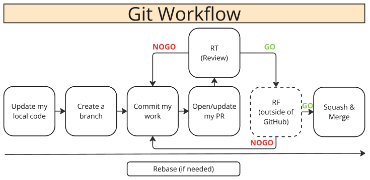

# HOWTO : Git

## Introduction
This document outlines the best practices and standardized process for using Git in our projects. Its goal is to ensure smooth collaboration and minimize potential conflicts and errors.

/!\ It is important to note that all our usage of Git is made in English (branch names, commit messages, ...)

---
## Table of Contents
1. [Installation and Setup](#installation-and-setup)
2. [Git Workflow](#git-workflow)
3. [Branch Naming Convention](#branch-naming-convention)
4. [Commits](#commits)
5. [Pull Request Management](#pull-request-management)
6. [Conflict Resolution](#conflict-resolution)
7. [Appendices & FAQ](#appendices-and-faq)
---

## Installation and Setup
### Git Installation
- **Mac**: `brew install git`
- **Windows**: [Git for Windows](https://git-scm.com/download/win)
- **Linux**: `sudo apt install git`

### Initial Configuration
Basic setup :
```bash
git config --global user.name "Your Name"
git config --global user.email "your.email@manda.fr"
```
Optionnal (for VSCode): 
```bash
git config --global core.editor "code --wait"
```

## Git Workflow
[comment]: # (Trust me, the line below works on Github wiki pages !)
test
[[/Git/workflow.png|Git workflow]]
and

end

### 0. Update local
Update your local main branch for the project.

For exemple, if main branch is `staging` : 
  ```bash
    git checkout staging
    git pull
  ```

### 1. Branch Creation
- Name branches according to the defined conventions (see [Branch Naming Convention](#branch-naming-convention)).
- Switch to the main branch (`staging`, `master` or `main`) and create a new branch from it:

    ```bash
    git checkout staging
    git checkout -b YY-XXXX-branch-name
    ```

### 2. Local Work
- Make necessary changes and commit regularly for significant steps (see [Commits](#commits)).

### 3. Pushing Changes
- Push changes to the remote branch with:

    ```bash
    git push origin YY-XXXX-branch-name
    ```

### 4. Pull Request and Review
- Create a Pull Request and randomly assign a reviewer (see [Pull Request Management](#pull-request-management)).


### Branch Naming Convention
Our chosen convention for branch naming is as follows: 
  ```
    YY-XXXX-branch-name
  ```
  - `YY-XXXX` corresponds to the related Jira issue. 
  For example, in `DM-1000`, the Jira issue is number 1000 in the "Delivery Manda" project (or DM).
  - `branch-name` is up to the developer’s discretion, but it should be clear and provide insight into the purpose of the branch. 

## Commits
### Writing Commit Messages
  ```bash
    git add mycode.file
    git commit -m "simple and comprehensive message in english"
  ```

### Good Examples
  ```
    add support for OAuth authentication
    fix pagination bug in results
    update README file with a process to install the app
  ```
### Bad Examples
  ```
    fix things
    did some changes
    update README
    lol
  ```

## Pull Request Management
At Manda, all major branches (`master`/`main`, `staging`, `dev`, ...) are protected. To modify the code, you need to submit a [pull request](https://docs.github.com/en/pull-requests/collaborating-with-pull-requests/proposing-changes-to-your-work-with-pull-requests/about-pull-requests).


### When do I create a PR ?
There are several reasons to open a PR : 
- My work is done and I need a review and the CI test suite
- I need a review but my work is not done
  - Open a [Draft PR](https://docs.github.com/en/pull-requests/collaborating-with-pull-requests/proposing-changes-to-your-work-with-pull-requests/changing-the-stage-of-a-pull-request#converting-a-pull-request-to-a-draft)
  - [Assign a reviewer](#assign-a-reviewer)
- I need a CI run (*The goal is to be able to run the CI locally, this is a workaround in the meantime*)
  - Open a [Draft PR](https://docs.github.com/en/pull-requests/collaborating-with-pull-requests/proposing-changes-to-your-work-with-pull-requests/changing-the-stage-of-a-pull-request#converting-a-pull-request-to-a-draft)
  - Do **not** assign a reviewer

### Creating a Pull Request
- Go on [Github](https://www.github.com/WeAreManda)
- Create a Pull Request, select your branch.
- Modify the description template, and mention the changes made.
- Then [Assign a reviewer](#assign-a-reviewer)

### Assign a reviewer
There are 2 ways to assign a reviewer @ Manda : 
- Select your Team as a Reviewer. This will randomly assign a dev from the team - **this is the standard process**
(*You can check the teams names on [Github](https://github.com/orgs/WeAreManda/teams)*)
- Select a developer directly - **this is not the standard process**

FYI : You can assign multiple reviewers if your PR needs cross-team review or multiple reviews.

### Code Review
- Each PR should be approved by at least one team member.
- Make sure to test and validate the changes locally.

### Merging Pull Requests
- Once the PR is approved, it needs to go through the RF - Product Testing
- Then, merge it with `staging` (or `main`) on Github interface (Squash&Merge)

## Conflict Resolution
See [Rebase Guide](./Rebase-Guide.md)

## Appendices and FAQ
### Useful Resources
- [Official Git Documentation](https://git-scm.com/doc)
- [Official Github Documentation](https://docs.github.com/fr)

### FAQ and Tips
**Q: I need to update my PR but I don't want the CI to run.**

A: If you don't need the CI to run, you can use the [CI Skip](https://docs.github.com/en/actions/managing-workflow-runs-and-deployments/managing-workflow-runs/skipping-workflow-runs) option in your commit message.
